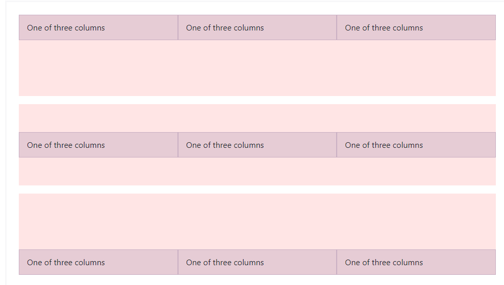
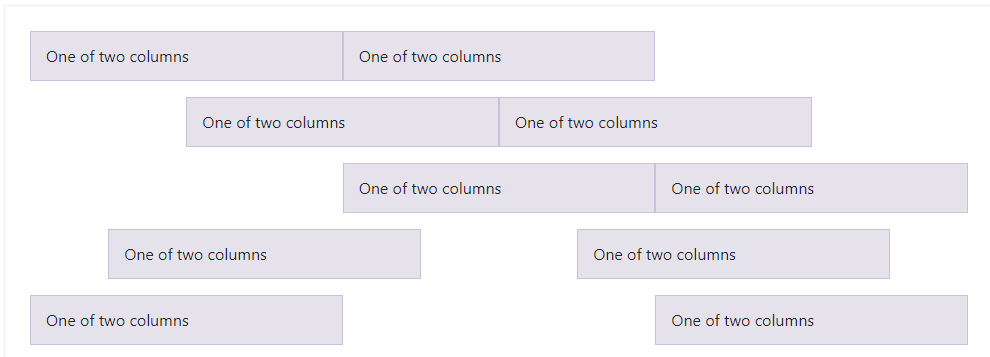

#栅格布局

标签（空格分隔）： 前端

---
## 1. 根容器
```html
  <!--标准根容器-->
  <div class="container"></div>
  <!--宽度占满的根容器-->
  <div class="container-fluid"></div>
```
---
## 2. 行与列

* 行元素：row
* 列元素：col

**自适应层次说明：**

层次名称 | 适应类型 | 范围
- | :-: | -:
col    | 全自适应    | ~576px
col-xs | 适应手机    | ~768px
col-sm | 适应平板    | ~992px
col-md | 适应笔记本  | ~1120px
col-lg | 适应超大屏  | ~

```html
<div class="container">
  <!--表示一行-->
  <div class="row">
    <!--表示一列，最多12列，超过12列将自动断行-->
    <div class="col">
      One of three columns
    </div>
    <!--表示一列，最多12列-->
    <div class="col">
      One of three columns
    </div>
    <!--表示一列，最多12列-->
    <div class="col">
      One of three columns
    </div>
  </div>
</div>
```


---
## 3. 断行
```html
<div class="container">
  <div class="row">
    <div class="col">Column</div>
    <div class="col">Column</div>
    <!--表示断行-->
    <div class="w-100"></div>
    <div class="col">Column</div>
    <div class="col">Column</div>
  </div>
</div>
```


---
## 4. 设置列栅格占比
> col-auto：表示根据DOM元素的内容宽度自适应栅格占比   
> col：若不手动设置占比或使用auto，将自动分配**填满**父容器的栅格占比
```html
<div class="container">
  <div class="row">
    <!--表示一列，若不进行栅格占比设置，将自动分配-->
    <div class="col">
      1 of 3
    </div>
    <!--表示一列，占一行的6格栅格，一行最多12格栅格，超过将自动断行-->
    <div class="col-6">
      2 of 3 (wider)
    </div>
    <!--表示一列，若不进行栅格占比设置，将自动分配-->
    <div class="col">
      3 of 3
    </div>
  </div>
  <div class="row">
    <div class="col">
      1 of 3
    </div>
    <!--表示一列，占一行的5格栅格，一行最多12格栅格-->
    <div class="col-5">
      2 of 3 (wider)
    </div>
    <div class="col">
      3 of 3
    </div>
  </div>
</div>
```


---
## 5.竖直对齐
### 5.1 容器全局对齐

> 用于控制一整行，或者某个部件的整个垂直布局

```html
<div class="container">
  <!--表示该行的所有栅格元素垂直靠上-->
  <div class="row align-items-start">
    <div class="col">
      One of three columns
    </div>
    <div class="col">
      One of three columns
    </div>
    <div class="col">
      One of three columns
    </div>
  </div>
  <!--表示该行的所有栅格元素垂直居中-->
  <div class="row align-items-center">
    <div class="col">
      One of three columns
    </div>
    <div class="col">
      One of three columns
    </div>
    <div class="col">
      One of three columns
    </div>
  </div>
  <!--表示该行的所有栅格元素垂直靠下-->
  <div class="row align-items-end">
    <div class="col">
      One of three columns
    </div>
    <div class="col">
      One of three columns
    </div>
    <div class="col">
      One of three columns
    </div>
  </div>
</div>
```


### 5.2 元素自身对齐

> 用于控制该元素本身的垂直布局（IE不能完美支持）

```html
<div class="container">
  <div class="row">
    <!--表示该栅格在行中垂直靠上-->
    <div class="col align-self-start">
      One of three columns
    </div>
    <!--表示该栅格在行中垂直居中-->
    <div class="col align-self-center">
      One of three columns
    </div>
    <!--表示该栅格在行中垂直靠下-->
    <div class="col align-self-end">
      One of three columns
    </div>
  </div>
</div>
```


---
## 6. 横向对齐

```html
<div class="container">
  <!--表示该行的元素整体横向靠右对齐-->
  <div class="row justify-content-start">
    <div class="col-4">
      One of two columns
    </div>
    <div class="col-4">
      One of two columns
    </div>
  </div>
  <!--表示该行的元素整体横向居中对齐-->
  <div class="row justify-content-center">
    <div class="col-4">
      One of two columns
    </div>
    <div class="col-4">
      One of two columns
    </div>
  </div>
  <!--表示该行的元素整体横向靠左对齐-->
  <div class="row justify-content-end">
    <div class="col-4">
      One of two columns
    </div>
    <div class="col-4">
      One of two columns
    </div>
  </div>
  <!--表示该行的元素横向均匀分布，长宽不变-->
  <div class="row justify-content-around">
    <div class="col-4">
      One of two columns
    </div>
    <div class="col-4">
      One of two columns
    </div>
  </div>
  <!--表示该行的元素横向两端对齐-->
  <div class="row justify-content-between">
    <div class="col-4">
      One of two columns
    </div>
    <div class="col-4">
      One of two columns
    </div>
  </div>
</div>
```



---
## 7. 去除栅格内部的间隙

```html
<!--使用no-gutters去除间隙-->
<div class="row no-gutters">
  <div class="col-12 col-sm-6 col-md-8">.col-12 .col-sm-6 .col-md-8</div>
  <div class="col-6 col-md-4">.col-6 .col-md-4</div>
</div>
```

---
## 8. 栅格排序

 > 注意：浏览器不能完全支持   

 一共有12个顺序，其中：  
   * order-last = order-13 排在最末  
   * order-first = order--1 排在最前

```html
<div class="container">
  <div class="row">
    <!--该栅格将在最后显示-->
    <div class="col order-last">
      First, but last
    </div>
    <div class="col">
      Second, but unordered
    </div>
    <!--该栅格将在最前显示-->
    <div class="col order-first">
      Third, but first
    </div>
  </div>
</div>
```


---
## 9. 偏移
```html
<div class="row">
  <div class="col-md-4">.col-md-4</div>
  <!--该栅格将偏移4格，即空出4格距离-->
  <div class="col-md-4 offset-md-4">.col-md-4 .offset-md-4</div>
</div>
<div class="row">
  <!--以下三个栅格都便宜了3格-->
  <div class="col-md-3 offset-md-3">.col-md-3 .offset-md-3</div>
  <div class="col-md-3 offset-md-3">.col-md-3 .offset-md-3</div>
</div>
<div class="row">
  <div class="col-md-6 offset-md-3">.col-md-6 .offset-md-3</div>
</div>
```

