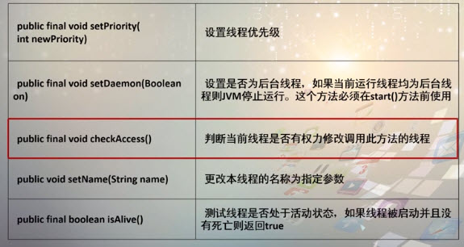

<font size="4">

# java多线程

by 菲尼莫斯 2019年3月16日

---

## 线程和进程

* 进程有独立的代码和数据空间，代表着多个程序多个任务流，进程间切换开销大

* 线程是轻量的进程，共享代码和数据空间，但有独立的运行栈和计数器，代表着一个程序多个任务流，线程切换开销更小

## 注意

* 同步：多线程并发访问共享数据时，保证共享数据再同一时刻只被一个或一些线程使用。
    * 阻塞同步：在某线程对共享数据进行操作时，其他线程暂停等待
    * 非阻塞同步：在并发环境下，某个线程对共享变量先进行操作，如果没有其他线程争用共享数据那操作就成功；如果存在数据的争用冲突，那就才去补偿措施，比如不断的重试机制，直到成功为止，这种乐观的并发策略不需要把线程挂起。

* 注意对于基本数据以及Boolean和Integer等包装类进行赋值是非线程安全的，若要保证多线程操作的原子性需要使用Atomic对象

* 后台线程（在Thread.start()前使用Thread.setDaemon(true)设置）：该线程不妨碍程序终止，只要前台还有一个线程进行，后台线程就不会结束，若前台已无线程，那所有的后台线程都会终止。

## 基础

* 实现方式：使用Thread类模拟新的CPU，运行独立的代码，能够管理独立的数据

* 线程体即为Thread的run()方法，并由start()方法所启动

* 只有主线程完毕或休眠后，子线程才有机会能够运行

* 此时子线程按照start顺序依次调用，只有一个子线程完毕或休眠，下一个子线程才有机会运行（或者由线程调度器决定）

* 实现Runnable接口的类，该类的同一个实例所创建的不同线程会**共享这个对象的实例属性**

* 线程的互斥：即对于共享数据，同一时刻只能用一个线程访问；监视区则是同一时刻只能被一个线程执行的方法
    1. 使用synchronized(共享数据 [data]) {// 进行互斥处理的操作 [deal]} 来创建一个线程锁
    2. 首先运行的A线程会获得data的线程锁，并运行deal代码
    3. data的线程锁只有一个，因此其他线程B必须等获得锁的A线程将锁释放才能运行deal操作
    4. 此时B会被放到data的**lock线程池**中
    5. 当获得线程锁的A线程将deal运行完毕后，便会释放data的线程锁
    6. 此时data的**lock线程池**中的B经调度重新获得data线程锁并运行deal
    * 也可以为**data对象的某个方法**加上synchronized关键字，从而保证该方法执行时对该对象触发线程锁
    * **线程休眠时不会释放线程锁**
    * 一条线程可以获得多个锁

* 线程的协作：多个线程有条件的同时操作共享数据，允许其他线程在满足条件的情况下进入监视区
    1. Data类的方法deal1和deal2被synchronized关键字修饰了
    2. 首先运行的A线程获得了data的线程锁并运行deal1操作
    3. deal1调用wait()方法，之后A线程进入data的**wait线程池**，A释放data的线程锁
    4. B线程获得data的线程锁并运行deal2操作
    5. 满足一定条件后deal2调用notify()操作使得（其实是随机唤醒一个等待线程）A线程被唤醒，并由data的**wait线程池**进入data的**lock线程池**
    6. B线程deal2继续运行，直到释放锁。
    7. A线程获得锁后继续运行wait()后的操作，由于不是立即开始运行，deal1此时还需判断此时的环境是否适合继续运行。
    * 在编程中，尽量在使用了notify/notifyAll() 后立即退出临界区，以唤醒其他线程 
    * notifyAll() 可以唤醒所有data的**wait线程池**的线程进入data的**lock线程池**

* 生命周期：
    * 诞生状态（刚被创建）
    * 就绪状态（调用start()后，此时需要等待cpu调度资源）
    * 运行状态
    * 阻塞状态（wait阻塞（wait池），synchronized阻塞（lock池），输入输出阻塞（读取文件，等待用户输入））
    * 休眠状态（sleep方法）
    * 死亡状态（运行完毕并结束）

* 构造线程：
    * 继承Thread类并重写run()方法
    
    ```java
    class MyThread extends Thread {
        @Override
        public void run() {
            System.out.println("it's a new thread");
        }
    }
    ```

    * 实现一个Runnable接口的实例，并用该实例初始化一个Thread对象

    ```java
    // 便于多个线程间共享资源，且可以继承其他的基类 
    class MyRun implements Runnable {
        // 该num会在同一个MyRun实例创建的所有线程中共享，类似于static
        private Integer num = 1;
        @Override
        public void run(){
            // 同一时间只允许一个线程操作num
            synchronized(num) {
                System.out.println(num ++);
            }
        }
    }
    Thread thread = new Thread(new MyRun());
    thread.start();
    ```

## 方法

* 休眠：Thread.sleep(ms)

* 线程名在new Thread时传入，否则默认为“Thread-n”，n从0递增

* Thread.currentThread()：返回当前运行的线程

* Thread.yield()：使当前线程暂停，让其他线程开始运行

* Thread.interrupt()：中断线程

* Thread.stop()：停止线程，并释放占用的对象锁，但会导致数据不完整，不推荐使用

* Thread A.join()：若A线程已启动，则等待A线程完毕才继续执行当前线程，可选参数为(long millis)，即超时时间后A还未运行完毕，则继续执行该线程

* 其他：




</font>