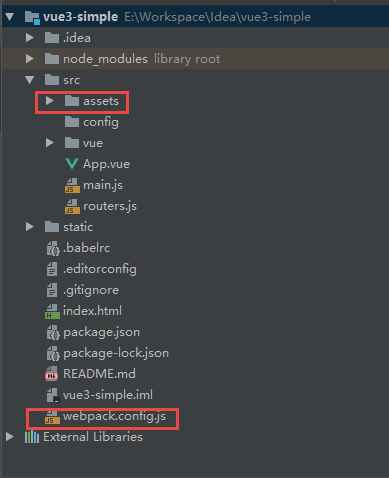

# vue&webpack

by 菲尼莫斯 于2019年3月27日重排

---

## 1. vue+webpack中动态绑定图片路径的3种方法
```html

```

###（1） 把图片放到src同级的static目录

```JavaScript
data() {
      return {
          mysrc:‘/static/icon/icon.png’
          }
      }
```

###（2） 用require加载

```JavaScript
data() {
      return {
          mysrc:require("../assets/img/icon.png")
          }
      }
```

###（3） 引用远程地址

```JavaScript
data() {
      return {
          mysrc:'http://xxx/img//2018/05/03/1525320695737407.jpg'
          }
      }
```

## 2. webpack路径映射设置
### （1）项目的目录结构如下图所示



### （2）webpack配置
* 我们要映射assets资源文件夹的路径，方便我们引用
* 我们为assets文件夹取别名为~assets
* 在webpack.config.js文件中,在resolve属性下写入如下配置

```JavaScript
resolve: {
    alias: {
      'vue$': 'vue/dist/vue.esm.js',
      '~assets':path.join(process.cwd(),'./src/assets')
    },
    extensions: ['*', '.js', '.vue', '.json']
  }
```
### （3）在项目中进行引用：
* 达到了避免使用麻烦的相对路径的目的
```JavaScript

  import filter from '~assets/js/myFilter';

  export default {
    name: "cart",
    data() {
      return {
        init: filter.join(['1', '2', '3'], '::')
      }
    }
  }
```
## vue-cli webpack

### 目录结构

vue项目的目录如下所示:
```bash
vueWebpack
│  .babelrc
│  .editorconfig
│  .eslintignore
│  .eslintrc.js
│  .gitignore
│  .postcssrc.js
│  index.html
│  package.json
│  README.md
│
├─build
│      build.js
│      check-versions.js
│      logo.png
│      utils.js
│      vue-loader.conf.js
│      webpack.base.conf.js
│      webpack.dev.conf.js
│      webpack.prod.conf.js
│      webpack.test.conf.js
│
├─config
│      dev.env.js
│      index.js
│      prod.env.js
│      test.env.js
│
├─src
│  │  App.vue
│  │  main.js
│  │
│  ├─assets
│  │      logo.png
│  │
│  ├─components
│  │      HelloWorld.vue
│  │
│  └─router
│          index.js
│
├─static
│      .gitkeep
│
└─test
    ├─e2e
    │  │  nightwatch.conf.js
    │  │  runner.js
    │  │
    │  ├─custom-assertions
    │  │      elementCount.js
    │  │
    │  └─specs
    │          test.js
    │
    └─unit
        │  .eslintrc
        │  index.js
        │  karma.conf.js
        │
        └─specs
                HelloWorld.spec.js
```
### 1. src目录
该目录用于存放所有的Vue代码源程序，以及静态资源等。
vue项目在创建时就已经约定好了资源文件的命名和存放规则，只需遵守这些规则，vue以及webpack都能够自动解析并打包我们的资源文件。
#### 页面及命名规则
  1. \*.vue文件统一以大驼峰式的命名法命名，如MyLoginPage.vue，**仅入口文件index.vue采用小写**。

  2. 文件夹目录统一使用小写字母命名，两个以上的词用“-”分割。

  3. css、js、jpg等资源文件命名同上。

  2. 单组件的场景直接用场景名命名vue文件并放于src的根目录。

  3. 多组件的场景，即页面有私有组件、js和过滤器的场景，src根目录建立一个与场景名相同的文件夹，页面文件（入口文件）以index.vue命名，与私有组件和私有js等放在一起。

  4. 测试文件命名使用：“目标文件.spec.js”命名。
#### 其他文件夹及规则
* **components:**  用于存放vue的公共组件。

* **main.js:**  用于vue的初始化以及组件的注册与渲染，所有的组件都应在此注册。

* **directives**  用于存放公共的js指令集如jQuery等，相当于java中的common，页面的私有js不应存放在此。

* **filters:**  用于存放公共的过滤器，同上。

* **assets:**  用于存放全局的公共资源的目录，可在其中新建images,css,fonts,plugin等文件夹进行资源细分（此处存放的是公共资源，页面的私有资源不应存放在此）

### 2. 其他目录
#### build
用于存放webpack的相关配置及辅助工具：

* webpack.base.conf.js ： 公用的基本配置

* webpack.dev.conf.js ： 开发环境用配置

* webpack.prod.conf.js ： 生产环境用配置
#### config
存放测试、开发、生产三大环境的配置文件，用于设定环境变量和必要的路径信息
#### test
用于存放E2E测试与等测试文件与测试配置文件
#### static
其他静态资源文件，excle等
#### dist
编译后的输出文件，可以直接部署到服务器的静态资源文件夹内，只有在build后才会生成。


