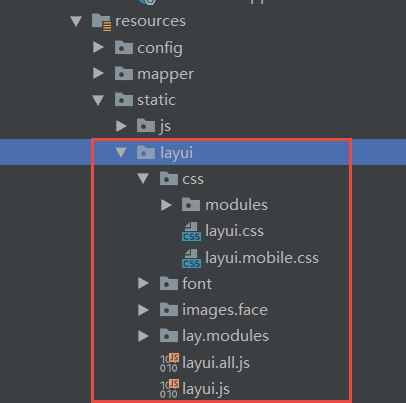
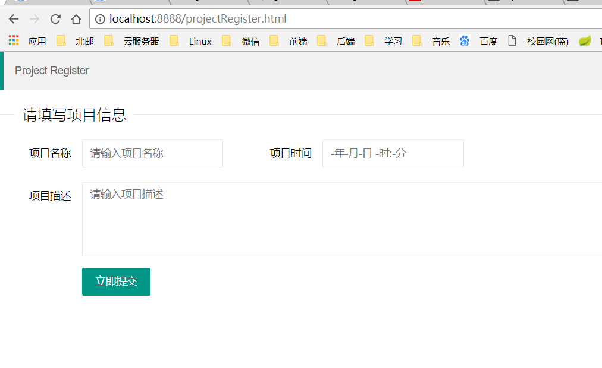

# layui基础使用

by 菲尼莫斯 2018年7月17日

---
## 下载layui

1. [下载layui](http://www.layui.com/)

2. 将整个插件放入static文件下




## 引入layui

1. 在.html文件的head元素下加入 \<link rel="stylesheet" href="/layui/css/layui.css"\>

2. 在.html文件末加入 \<script charset="UTF-8" src="/layui/layui.js"\>\</script\>

## 表单美化

改造projectRegister.html文件中的body部分：

```html
<body>
<blockquote class="layui-elem-quote layui-text">
    Project Register
</blockquote>
<fieldset class="layui-elem-field layui-field-title" style="margin-top: 20px;">
    <legend>请填写项目信息</legend>
</fieldset>
<form class="layui-form" action="project/doRegister" method="post">

    <div class="layui-form-item">
        <div class="layui-inline">
            <label class="layui-form-label">项目名称</label>
            <div class="layui-input-inline">
                <input type="text" name="name"   placeholder="请输入项目名称"
                       class="layui-input">
            </div>
        </div>

        <div class="layui-inline">
            <label class="layui-form-label">项目时间</label>
            <div class="layui-input-inline">
                <input type="text" name="time" id="time"  placeholder="-年-月-日 -时:-分"
                       class="layui-input">
            </div>
        </div>
    </div>

    <div class="layui-form-item layui-form-text">
        <label class="layui-form-label">项目描述</label>
        <div class="layui-input-block">
            <textarea name="description"  class="layui-textarea" placeholder="请输入项目描述"></textarea>
        </div>
    </div>


    <div class="layui-form-item">
        <div class="layui-input-block">
            <button class="layui-btn">立即提交</button>
        </div>
    </div>
</form>
</body>
```
效果：



##日期选择器

在页面末加入script脚本区域(一定要在layui.js的引入之后)：

```html
。。。。。。。。。。。。。。。。
。。。。。。。。。。。。。。。。
<body>
。。。。。。。。。。。。。。。。
。。。。。。。。。。。。。。。。
<div class="layui-inline">
    <label class="layui-form-label">项目时间</label>
    <div class="layui-input-inline">
        <input type="text" name="time" id="time"  placeholder="-年-月-日 -时:-分"
               class="layui-input">
    </div>
</div>
。。。。。。。。。。。。。。。
。。。。。。。。。。。。。。。
</body>

<script charset="UTF-8" src="layui/layui.js"></script>
<script>
//启用layui的js功能
layui.use(['form','laydate'],function () {
  var form = layui.form
  //启用layui的时间选择器的功能
  ,laydate=layui.laydate;

  //初始化日期选择器
  laydate.render({
    //elem对应上面输入时间的input的id
    elem:'#time',
    type:'datetime',
    format:'yyyy年MM月dd日 HH:mm:ss'
  });

})
</script>

```

**controller接收时设置：**

由于接收到的time属性是“yyyy年MM月dd日 HH:mm:ss”的格式，我们的controller并不能直接将其识别为Date对象，我们需要添加一些识别代码。


```java
。。。。。。。。。。。。。。。。.
ProjectController.java :
。。。。。。。。。。。。。。。。。
/*
 * 可以看到controller中我们用project 这个bean接收数据
 * 因此我们需要在project这个类中申明一下它的time属性：
 */
@RequestMapping(value = {"/doRegister"}, method = RequestMethod.POST)
   public String doRegister(Model model, Project project) {
       //project.setTime(new Date());
       model.addAttribute("project", project);
。。。。。。。。。。。。。。。。
Project.java :
。。。。。。。。。。。。。。。。
public class Project {
    private String name;
    private String description;
    //在javabean中标注该date属性的识别方式
    @DateTimeFormat(pattern = "yyyy年MM月dd日 HH:mm:ss")
    private Date time;
。。。。。。。。。。。。。。。。。
。。。。。。。。。。。。。。。。。
```


