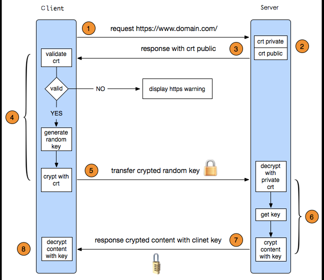

# http入门

by 菲尼莫斯  2019年3月12日

---

## 资源

http本质是对资源的访问和调取

### 通过MIME标签来标识资源类型和特性，如：

`Content-type: image/jpeg`

`Cache-Control: private`

### URI（统一资源标识符），唯一标识一种资源

* URL(统一资源定位符) 描述特定服务器上的某资源的**位置**

    `http://www.baidu.com/logo.jpg`

    * http: 方案，说明了访问的协议类型

    * www.baidu.com：服务器的地址

        * com：一级域名

        * baidu：二级域名 （DNS服务优先查找一级域名）

    * /logo.jpg：资源在服务器上的位置

* URN（统一资源名），特点内容的唯一名称，与资源位置无关

    * `urn:ietf:rcf:2141`：RFC因特网标准文档

## 事务

http对资源的处理

* 组成：**请求命令**，**响应结果**

* 通信：报文，格式化数据块

* 方法：即请求命令

`GET` `POST` `PUT` `DELETE` `HEAD` 等

* 状态码
    * 1：信息提示
    * 2：成功
    * 3：重定向
    * 4：客户端错误
    * 5：服务端错误

## 报文

http通信的方式

### 请求

* 起始行：**请求命令** **资源在服务器的位置** **协议及版本**

* 首部：MIME标签、POST数据

* 主体：GET和PUT内容

### 响应

* 起始行：**协议及版本** **状态码及状态说明**

* 首部：MIME标签

首部可以有零个或多个，标签之间以行隔开，首部以一个空行结束

```
Content-type: text/plain
Content-length: 19

```

* 主体：资源内容

主体可以包含文本，及任意的二进制数据（比如图片、视频、音轨、软件程序）

## 连接（传输控制协议）

报文如何通过协议进行传递

### TCP/IP

* 无差错传输

* 有序传输（数据总是按发送顺序到达）

* 未分段的数据流（在任意时刻发送任意尺寸数据）

| 协议  | 层级 | 说明 |
| ----- | -----| ------ |
| HTTP | 应用层 | 传递和解析数据报文 |
| TCP | 传输层 | 建立连接，保障可靠通信 |
| IP | 网络层 | 寻址 |
| 网络中特有链路接口 | 数据链路层 | 将数据块转化为帧|
| 物理网络硬件 | 物理层 | 将帧转化为比特流 |

* 通信必须要有IP地址和服务器端口号

* 建立过程（三次握手）

    1. client => server : SYN seq = x

    请求建立连接：客户端向服务器发送小的TCP分组（40 ~ 60字节），设置的SYN标记表明这是一条连接请求

    2. server => client : SYN seq = y, ACK = x + 1

    收到建立连接请求，已建立连接，请回复并发送数据：如果服务端接受了连接，便对一些连接参数进行计算，向服务端发送一个TCP分组，SYN和ACK标记都被置位，说明连接已被接受

    3. client => server : ACK = y + 1

    收到已建立连接请求，接下来将发送数据：客户端向服务器回送一条确认信息ACK，表明连接已成功建立（**允许客户端在这个确认消息的TCP分组中携带要发送的数据**）

    * ACK = x + 1 表示数据接收者已经收到数据发送者发送的 SYN seq = x 的这条数据

    * 之后的数据传输便以数据发送者的x，y（服务端也可以发送数据）为基础不断递增，从而标识了每条请求和回应的先后顺序

* 断连过程（四次挥手）

    1. 主动关闭方 => 被动关闭方 : FIN seq = x + n, ACK = y + m

    数据已发送完，请求关闭连接

    2. 被动关闭方 => 主动关闭方 : ACK x + n + 1

    收到关闭连接请求

    3. 被动关闭方 => 主动关闭方 : FIN seq = y + m

    数据已发送完，请求关闭连接

    4. 主动关闭方 => 被动关闭方 : ACK y + m + 1

    收到关闭连接请求，已关闭连接

### 浏览器中的连接

1. 浏览器从URL解析出主机名

2. 浏览器根据URL查找浏览器缓存（如直接缓存的页面和DNS信息）

3. 调用系统缓存查找DNS

4. 浏览器向路由发送请求查找路由DNS缓存

5. 路由器将请求发送到IPS（互联网服务提供商）的DNS服务器

6. IPS向根域名服务器进行搜索，若未搜索到则说明域名不存在

7. 浏览器通过DNS服务器将主机名转换为IP地址

8. 浏览器从URL中解析端口号

9. 浏览器建立一条与web服务器的TCP/IP连接

10. 浏览器向服务器发送一条HTTP请求报文（携带cookie）

11. 服务器向浏览器回送一条HTTP响应报文

12. 浏览器读取请求头，解析报文

13. 关闭连接，浏览器显示资源内容

## Telnet

telnet 可以与目标服务器（地址）间建立一条TCP/IP连接

建立连接后可以按照HTTP报文格式输入请求内容，从而实现HTTP通信

## HTTP版本

* 1.0：能够传输文本外的内容，添加MIME和HTTP方法

* 1.1：特性调整，修复缺陷，明确语义

* 2.0：大幅优化性能，更强大的远程执行框架

* https：




