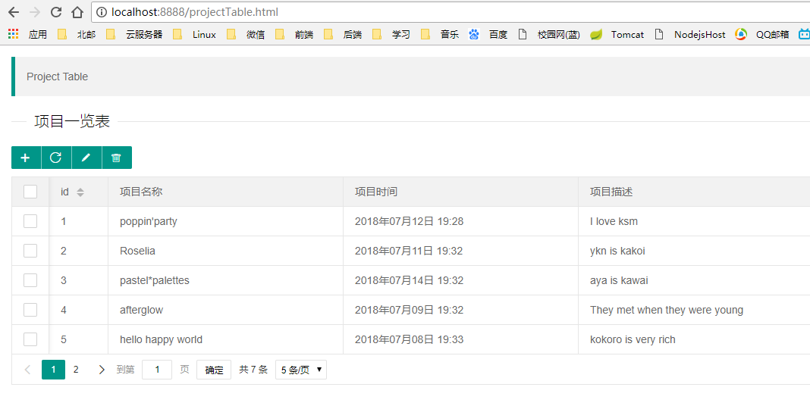

<font size="4">

# layui表格

by 菲尼莫斯 2018年7月18日

---

## 页面效果展示

我们在static下新建一个projectTable.html页面



## 页面HTML代码

```html
<!DOCTYPE html>
<html lang="en">
<head>
    <meta charset="UTF-8">
    <title>Project Table</title>
    <link rel="stylesheet" href="layui/css/layui.css">
</head>
<style>
    body {
        padding: 15px;
        overflow-y: scroll;
    }

    .layui-body {
        overflow-y: scroll;
    }

</style>
<body>
<blockquote class="layui-elem-quote layui-text">
    Project Table
</blockquote>
<fieldset class="layui-elem-field layui-field-title" style="margin-top: 20px;">
    <legend>项目一览表</legend>
</fieldset>
<div class="layui-btn-group">
    <button class="layui-btn layui-btn-sm" data-type="add">
        <i class="layui-icon">&#xe654;</i>
    </button>
    <button class="layui-btn layui-btn-sm" data-type="reload">
        <i class="layui-icon">&#xe669;</i>
    </button>
    <button class="layui-btn layui-btn-sm" data-type="edit">
        <i class="layui-icon">&#xe642;</i>
    </button>
    <button class="layui-btn layui-btn-sm" data-type="del">
        <i class="layui-icon">&#xe640;</i>
    </button>
</div>


<table class="layui-hide" id="tableId" lay-filter="tableFilter"></table>


<script charset="UTF-8" src="layui/layui.js"></script>
<script charset="UTF-8" src="js/dateFormat.js"></script>
<script charset="UTF-8" src="js/projectTable.js"></script>

</body>
</html>

```

其中：
对应如下代码：
```html
<div class="layui-btn-group">
    <button class="layui-btn layui-btn-sm" data-type="add">
        <i class="layui-icon">&#xe654;</i>
    </button>
    <button class="layui-btn layui-btn-sm" data-type="reload">
        <i class="layui-icon">&#xe669;</i>
    </button>
    <button class="layui-btn layui-btn-sm" data-type="edit">
        <i class="layui-icon">&#xe642;</i>
    </button>
    <button class="layui-btn layui-btn-sm" data-type="del">
        <i class="layui-icon">&#xe640;</i>
    </button>
</div>

```

具体的icon式样可以在[layui文档](http://www.layui.com/doc/element/icon.html)找到

## 引入页面控制相关的js文件


```html
<script charset="UTF-8" src="js/dateFormat.js"></script>
<script charset="UTF-8" src="js/projectTable.js"></script>
```
由于该页面需要用到较多的js脚本来控制页面逻辑，为了不影响.html代码的可读性，我们将其中的js内容抽取出来放到了单独的.js文件中，并通过以上方法进行引入。


dateFormat是一个进行日期格式转换的js函数，是一个通用的js工具包，可以在今后的项目中进行使用，其代码如下：

```js
/**
 * 时间和日期格式化
 */

function dateFormat(fmt, date) {

  if (!(date instanceof Date)) {
    return dateFormat(fmt, new Date(date));
  } else {
    var o = {
      "M+": date.getMonth() + 1, //月份
      "d+": date.getDate(), //日
      "h+": date.getHours() % 12 == 0 ? 12 : date.getHours() % 12, //小时
      "H+": date.getHours(), //小时
      "m+": date.getMinutes(), //分
      "s+": date.getSeconds(), //秒
      "q+": Math.floor((date.getMonth() + 3) / 3), //季度
      "S": date.getMilliseconds() //毫秒
    };
    var week = {
      "0": "/u65e5",
      "1": "/u4e00",
      "2": "/u4e8c",
      "3": "/u4e09",
      "4": "/u56db",
      "5": "/u4e94",
      "6": "/u516d"
    };
    if (/(y+)/.test(fmt)) {
      fmt = fmt.replace(RegExp.$1, (date.getFullYear() + "").substr(4 - RegExp.$1.length));
    }
    if (/(E+)/.test(fmt)) {
      fmt = fmt.replace(RegExp.$1, ((RegExp.$1.length > 1) ? (RegExp.$1.length > 2 ? "/u661f/u671f" : "/u5468") : "") + week[date.getDay() + ""]);
    }
    for (var k in o) {
      if (new RegExp("(" + k + ")").test(fmt)) {
        fmt = fmt.replace(RegExp.$1, (RegExp.$1.length == 1) ? (o[k]) : (("00" + o[k]).substr(("" + o[k]).length)));
      }
    }
    return fmt;
  }
}

```

我们不用知道它的原理，使用时只需调用dateFormat(fmt, date)函数即可，示例如下：

```js
var dateStr = dateFormat('yyyy年MM月dd日 HH时mm分ss秒', new Date());
```


</font>
